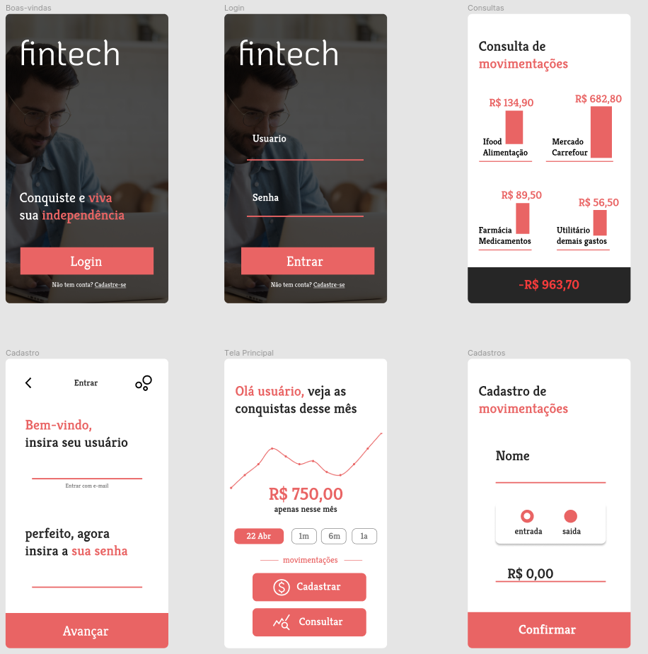

<p align="center">

</p>

# ✨ Fintech FIAP

## Desenvolvimento de Telas do Health Track 📝

<br>

### Com base nas telas que foram desenhadas na Fase 2 (Prototyping), você deve escolher duas e transpô-las, recriando-as utilizando HTML, CSS e Bootstrap.

* Você deverá criar no mínimo 2 telas.

<br>

### Algumas observações:

* Mantenha o HTML separado do CSS em arquivos .html e .css, respectivamente.

* Use e abuse do Bootstrap: deixe o CSS para personalizações que “fujam” dos padrões do framework (com ele é mais rápido!).

<br>

### Sugestão:

* Cuide da navegação do sistema. O formulário de login deve ser redirecionado diretamente para a página do dashboard (em outra atividade futura, com uma programação intermediária, vamos processar a autenticação validando o login e a senha).

* A página do dashboard deve possuir um menu com links para as outras funcionalidades.

* Os formulários de adicionar/cadastrar informações devem redirecionar diretamente para as listagens de suas informações (por enquanto, não se cadastra nada, de fato).

* Formulários de alteração ou listagens devem possuir dados fictícios para termos uma ideia de como a tela vai ficar quando realmente estiver pronta.

Fique à vontade para criar um layout bem atraente, utilizando fotos, imagens, ícones (mas use o bom senso).

<br>

# 🛠 Tecnologias
- [x] React
- [x] Bootstrap
- [x] JavaScript
- [x] CSS
- [x] HTML

<br>

# 🧑‍💻 Build do projeto
Após clonar o repositório em sua máquina rode o comando abaixo:
```
yarn start
```

<br>

# 📄 Telas do projeto
<p align="center">

</p>